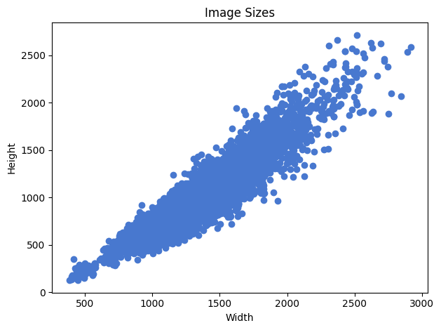
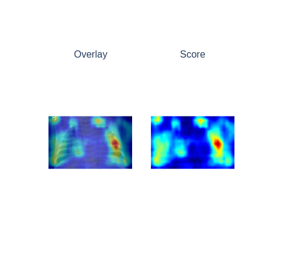

# Explainable-AI
Computer Vision classification for medical baterical and viruses

<p align="center">
  
</p>

## Folder Structure

```
.
├── conf
│   └── base
│       └── logging.yaml
|
├── docker
│   ├── docker-compose.yaml
│   ├── fastapi.Dockerfile
│   ├── fastapi_requirements.txt
│   ├── sl.Dockerfile
│   └── sl_requirements.txt
|
├── model_assets
│   └── model.pt
|
├── notebooks
│   ├── 1. EDA.ipynb
│   ├── grad_cam.ipynb
|
├── src
│   ├── api
│   │   ├── __init__.py
│   │   ├── prediction.py
│   │   └── server.py
|   |
│   ├── EDA.py
│   ├── EDA_utils.py
│   ├── __init__.py
│   ├── model.py
│   ├── sl.py
│   ├── train.py
│   └── utils.py
|
└── tb_logs
|
├── images
|
├── LICENSE
|
├── README.md
```

## Standard Usage

<lb>

### Fastapi and Streamlit

The Fastapi is dockerised and hosted on port 8000, the Streamlit frontend is dockerised and hosted on port 8501.


For the Fastapi and Front-end Streamlit run the docker compose in your terminal.

```
docker compose --file docker/docker-compose.yaml up
```

<lb>

### Training Pipeline
For the training pipeline run the python training pipeline file.
```
python src/train.py
```

You will be prompt for a training mode enter `train` or `finetune` for your respective use case
## Images EDA

### Imports
The EDA notebook imports a couple of functions from `src/EDA.py` and `src/EDA_utils.py`

### Setting up of folders
Before conducting any EDA a portion of setting up the raw data into the Train/Test/Val folders is needed. This is covered in the EDA notebook in `notebooks/EDA.ipynb`. 


### Findings

An important finding was that when doing the canny edge plots for the bacteria and virus images it would seems that there were shades blocking the ribs itself.

<p align="center">
  
</p>

There are others image plot counts, the aspect ratios and plot counts also explored

<p align="center">
  
</p>

<p align="center">
  
</p>

<p align="center">
  
</p>

## Model Used


### Mobilenet V2

<p align="center">
  
</p>

<p align="center">
  
</p>


The MobileNet v2 architecture is based on an inverted residual structure where the input and output of the residual block are thin bottleneck layers opposite to traditional residual models which use expanded representations in the input. MobileNet v2 uses lightweight depthwise convolutions to filter features in the intermediate expansion layer. Additionally, non-linearities in the narrow layers were removed in order to maintain representational power.

<lb>

### Full Architecture of Model used

<p align="center">

</p>

## Grad_Cam

The initial pretrain model learns from the part that has a bit of shade of the images when shown clearly in the eda, this is reflected in the gradcam highlights.

### Virus Pretrained
<p align="center">
  
</p>

### Bacteria Pretrained
<p align="center">
  
</p>

After the model is trained on the data with varying x-ray images, the model looks at a much larger area of where the shades maybe this is reflected in the gradcam.

### Virus Trained Model
<p align="center">
  
</p>

### Bacteria Trained Model

<p align="center">
  
</p>